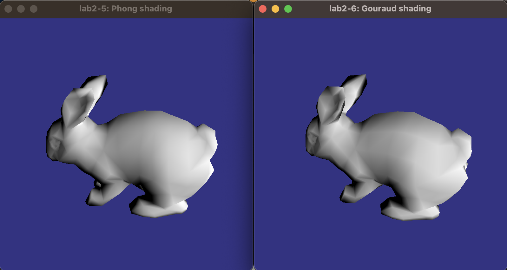

### Questions for lab 2

 
#### Part 1)

**What kind of procedural texture did you make?**

Interpolated texture coordinates as color.

 
#### Part 2)

**How are the textures coordinates mapped on the bunny? Can you see how they vary over the model?**

The texture coordinates are mapped with *Linear mapping*

When texture coordinates are *(s, t) = (0, 0)*, the color will be blue, RGB - (s, t, 1). When we have *(s, t) = (1, 1)* we will have white.

 

**How can you make a texture repeat multiple times over the bunny?**

With `GL_TEXTURE_WRAP_S` and `GL_TEXTURE_WRAP_T` 

 

**Why can't we just pass the texture object to the shader? There is a specific reason for this, a limited resource. What? (No, it is not that we must avoid re-uploading from CPU. The texture object is on the GPU!)**

<!--In order to use pre-generated texture data, they must be loaded into a texture object by the host program, which must then be attached to a texture unit, and then you should communicate the texture unit number to the shader.*

*- Texture units are hardware resources for looking up textures*

*- The shader uses the texture unit ID, not the texture object*-->

We are using texture units because there are fast. We have 16 texture units.

 

#### Part 3)

**How did you move the bunny to get it in view?**

I used a transform with position *(0, 0, -2)*.

 

#### Part 4)

**Given a certain vector for v, is there some place you can't place the camera?**

You can give `v` (up-vector) the value *(0, 0, 0)*. In that case, no axis is up; therefore, nothing is shown. 

<!--l is the vector towards the light source-->

 

#### Part 5)

**Did you implement your light calculations in the vertex or fragment shader? So, which kind of shading did you implement?**

The light calculations were done in the fragment shader (per-pixel basis); for this reason, the Phong shading is used. 

 

**Some geometry data must be vec4, others are just as well vec3's. Which ones, and why? How about vertices, light source, normal vectors...?**

When translations are needed, vec4 is used. This is because we have added a homogeneous coordinate for us to be able to move the origin. 

For colors we need mat4 to be able to have an alpha value

 

#### Part 6)

**Was the difference big? If not, why?**
The lighting at the vertices is smoother when using Phong shading.

 

#### Part 7)

**If you rotate an object or rotate the camera, what matrices are affected?**

Rotating object: Rotating model-to-world matrix with `cameraMatrix * rotationMatrixY`

Rotating camera: Rotating world-to-view matrix `translationMatrix * rotationMatrixY`