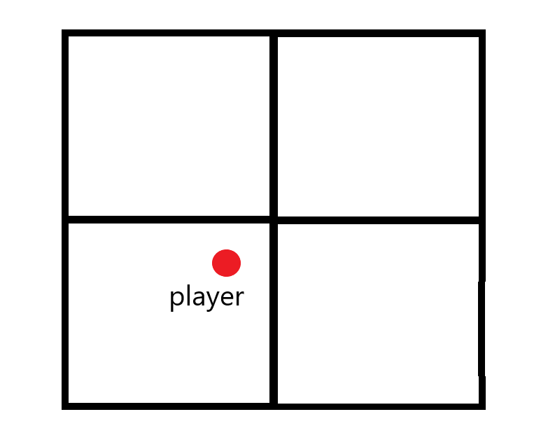

### Questions for lab 4

#### Part 1)

**What kind of data does the heightmap image data hold? What range is the heightmap data?**

Each value in the heightmap represents the height of the point on the surface. 

Value from 0 to 1, -1 to 1 or 0 to 255


</br>

**The terrain is 4x4. How many polygons does it draw?**

```math
(width-1) * (height-1) = 3 * 3 = 9
```


----

#### Part 2)

**Did you need to extend your camera movement code? How?**

Add added the ability to move upp and down (along the y-axis)

Movement: **w** - forward, **s** - backward, **a** - left, **d** - right, **q** - down, **e** - up. 
Looking: **mouse** - up, down, left, right


----

#### Part 3)

**Which method did you use to find the normal vector?**

I used the cross method.


----

#### Part 4)

**How did you figure out what surface to use?**

For quad I used points:
```math
(⌊x⌋, ⌊y⌋)
```
```math
(⌊x⌋ + 1, ⌊y⌋)
```
```math
(⌊x⌋, ⌊y⌋ + 1)
```
```math
(⌊x⌋ + 1, ⌊y⌋ + 1)
```

To select which triangle to use:
```C
if ((x - floor(x)) + (z - floor(z)) < 1.0) {
    // Use triangle closest to origin.
} else {
    // ...
}
```


</br>

**How did you calculate the height from the surface?**
```math
(a, b, c) = normal(vertex1, vertex2, vertex3)
```
```math
- d = (a * x) + (b * y) + (c * z)
```
```math
height = (- d - (a * point_x) - (c * point_z)) / b
```


----

#### Part 5)

**What kind of multitexturing function did you implement?**

I used `mix()` for textures. I based the level of blending on the normal. 


----

#### Part 6)

**Which kind of “infinity” did you make?**

I'am drawing 4 patches. One patch where the player stand. Two patches that are second closest to the player, and the one patch which is adjacent to the other two.




